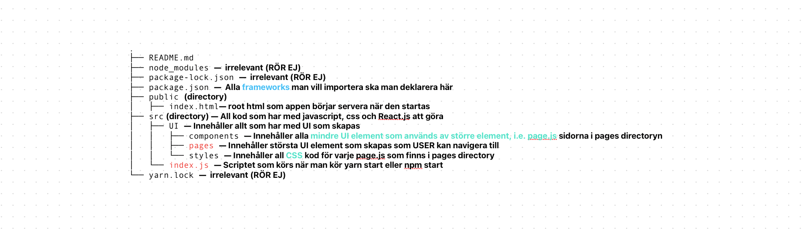

# Project structure top 3 levels – updated last on 22 februari 2024




```python
  The manifest.json file is a JSON (JavaScript Object Notation) file that provides metadata about a web application. 
  It includes information such as the application's name, icons, theme colors, display mode, and other properties. 
  This metadata helps browsers understand how to display the web application when it's added to the home screen of a user's device or launched in standalone mode.
```

```python
The robots.txt file (finns i Backend mappen)is a text file used to provide instructions to web robots (also known as web crawlers) about which pages or files on a website they are allowed to crawl or not. This file is particularly useful for search engine crawlers like Googlebot, Bingbot, and others.

In the context of a React app directory, the robots.txt file is typically placed at the root directory of the application alongside other important files like index.html, manifest.json, etc.
```


# Useful commands for this project

### Start the APP

`yarn start` OR `npm start` 

Starts the App (root of the app is index.js)


### install and update all packages defined as project dependencies in package.jason

`yarn install` OR `npm install` 

When you run yarn install, yarn fetches and installs all the dependencies listed in your project's package.json file. 
It checks for updates and installs the necessary packages to the node_modules directory in your project.

##### sometime npm does not work, 1. remove package-lock.jason, 2. try npm install — if it does not work properly and dont dcreate a directory named node modules then 3. try yarn install (after that you can start the app via npm start or yarn start)


### install specifik package

`yarn install package` OR `npm install package` 


When you run yarn install, yarn fetches and installs all the dependencies listed in your project's package.json file. 
It checks for updates and installs the necessary packages to the node_modules directory in your project.

##### sometimes npm does not work properly —> 1. remove package-lock.json, 2. try npm install — if it does not work properly and dont dcreate a directory named node modules then 3. try yarn install (after that you can start the app via npm start or yarn start)

### optimize yarn build performance

https://www.developerway.com/posts/three-simple-tricks-to-speed-up-yarn-install

https://github.com/scinos/yarn-deduplicate

### ❗️☠️ Depreciated for now – find errors using ESLint

`yarn run lint`

To see if something is not correct

`yarn run lint:fix`

Fix issues raised automatically


